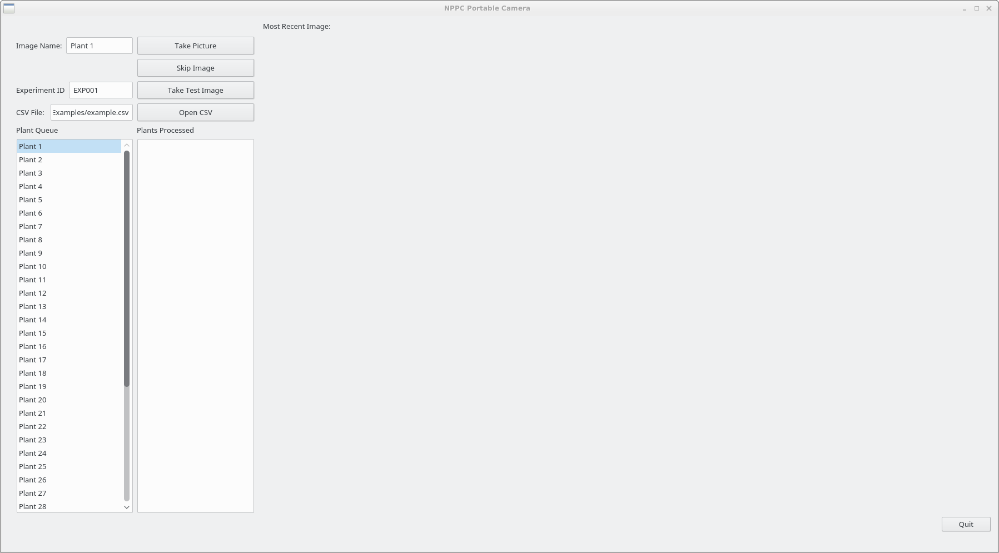

# Portable Imaging Rig

[](https://zenodo.org/badge/latestdoi/80664597)

A portal imaging rig for taking large numbers of pictures of plants out and about. It has a simple to use graphical user interface that makes it easy to ensure all images are correctly labelled for the plant they are photographing saving hours of painstaking labour to do this manually. 




## Dependencies
gphoto2
python 3

## Usage
To use this simple open a terminal and run: 

```
python3 main.py example.csv 
```

Where you replace the csv with any that is in the same format
